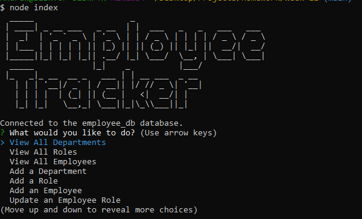
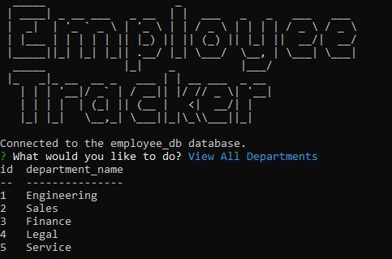
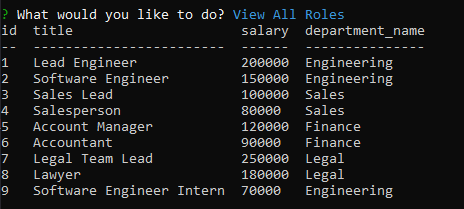
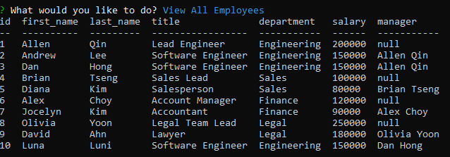

# employee-tracker


## Description

The main purpose of this project is to create an employee tracker application to look at each employee's company information! The user will be able to quickly glance at each employee's department information, role information, and general information in tables created with MYSQL.

You may find the walkthrough video [here](https://youtu.be/jkeK_pOjC2k/).

## Table of Contents

- [Installation](#installation)
- [Usage](#usage)
- [Questions](#questions)
- [License](#license)
- [Credits](#credits)

## Installation

To run this application, you will first need to clone this repository. Then, you will have to run the following code:

```
npm i
```

After that, the application is ready to run with the following code:

```
node index
```

## Usage

Please find a screenshot of the main menu!


Please find a screenshot of the department list!


Please find a screenshot of the roles list!


Please find a screenshot of the employee list!


Please use arrow keys to navigate up and down the main menu.

If you would like to quit, please choose the "Quit" option to exit.

## Questions

If you have any questions, please feel free to reach me at:

- GitHub: Yahplee
- Email: [alee68@fordham.edu](mailto:alee@fordham.edu)

## License

This project is nested under the following license: MPL2.0

## Credits

Copyright © Yahplee All rights reserved.
